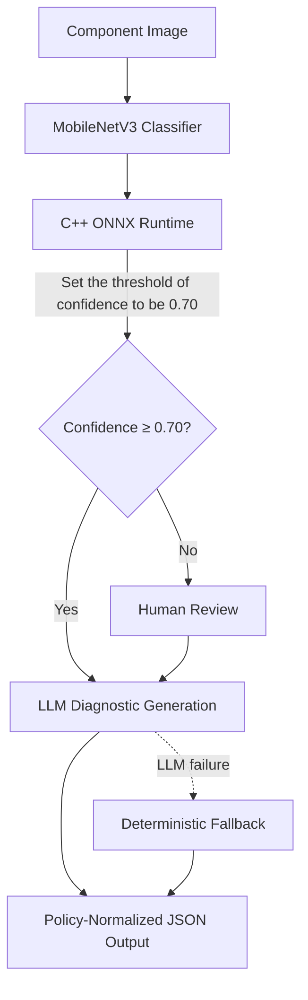

# AI Visual Recognition & LLM Intelligent Diagnostic System for Electronic Components

An intelligent diagnostic system that combines visual recognition with Large Language Models (LLMs) to identify and diagnose electronic components from images.

> **Note:** Large Qwen3 GGUF and adapter artifacts are available in the [GitHub Release — artifacts-v1](https://github.com/ChenKC863/AI-Visual-Recognition-and-LLM-Intelligent-Diagnostic-System-for-Electronic-Components/releases).

---

## Dataset

### Sources
- [1] [Electronic-Components-Classification (GitHub)](https://github.com/pouria-faraj/Electronic-Components-Classification)
- [2] [Electronic Components and Devices (Kaggle)](https://www.kaggle.com/datasets/aryaminus/electronic-components)


### Original Dataset(for my choice)

```text
Electronic components/
└── images/
  ├── Inductor/ # 265 images [1]
  ├── Resistor/ # 470 images [1]
  ├── Solenoid/ # 317 images [2]
  └── Transformer/ # 747 images [1]
```

### Cleaned Dataset
After data cleaning and preprocessing:

```text
Electronic components/
└── images/
  ├── Inductor/ # 260 images
  ├── Resistor/ # 470 images
  ├── Solenoid/ # 310 images
  └── Transformer/ # 740 images
```


---
## 📌 Overview
This project presents an end-to-end intelligent diagnostic system for electronic components, combining computer vision, C++ inference, a fine-tuned Large Language Model (LLM), and human-in-the-loop workflow orchestration. The system classifies component images, evaluates prediction confidence, and produces structured diagnostic guidance for manufacturing operators.

The current prototype supports four component classes:

- Inductor
- Resistor
- Solenoid
- Transformer

A balanced working dataset of **1,040 images** was used, with **260 images per class**:

- Training: 728 images
- Validation: 156 images
- Testing: 156 images

### System Workflow



The project covers the complete AI lifecycle:

1.) **Image classification**  
   MobileNetV3-Small and MobileNetV3-Large models are trained using PyTorch transfer learning. Training uses on-the-fly data augmentation, label smoothing, weight decay, learning-rate scheduling, early stopping, and a two-stage fine-tuning strategy.

2.) **Portable C++ inference**  
   The trained models are exported to ONNX and executed locally through a C++17 inference engine using ONNX Runtime and OpenCV. The engine performs image preprocessing, classification, latency measurement, confidence visualization, JSON output, and batch CSV export.

3.) **Domain-specific LLM fine-tuning**  
   Vision predictions are converted into conversational JSONL datasets and used to fine-tune `Qwen3-4B-Instruct-2507` with QLoRA, Unsloth, PEFT, and TRL `SFTTrainer`. The fine-tuned model is exported to the GGUF `Q4_K_M` format for local deployment through Ollama.

4.) **Structured diagnostic output**  
   The LLM produces a validated JSON object containing the predicted component, confidence score, review decision, component function, recommended operator action, and system limitations.

5.) **Confidence-based human review**  
   A fixed confidence threshold of **0.70** controls whether a prediction can proceed automatically. Low-confidence cases are routed to an operator, who can approve, reject, or correct the prediction.

6.) **LangGraph orchestration**  
   LangGraph manages workflow state, conditional routing, human-review interruptions, local knowledge retrieval, LLM calls, and deterministic fallback behavior.

7.) **Reliable fallback and policy enforcement**  
   A local component knowledge base provides verified component functions, operator actions, and limitations. If the LLM is unavailable or returns malformed JSON, the system generates a deterministic diagnostic response instead. Final normalization prevents the LLM from contradicting the confidence policy.


## Project Structure
```text
Four_electronic_components/
├── .git/
├── .gitignore
├── .vscode/
├── .venv/
├── .venv_win/
├── agent/
├── build/
├── configs/
├── knowledge/
├── model/
├── qwen3-4b-instruct-2507-{variant}_model-artifacts/
│     ├── adapter/
│     ├── evaluation/
│     ├── gguf_gguf/
│     ├── prepared_data/
│     ├── artifact_manifest.json
│     ├── confidence_threshold.json
│     ├── environment.json
│     ├── requirements-cloud-lock.txt
│     ├── SHA256SUMS.txt
│     └── training_config.json
├── release_assets/
├── scripts/
├── test/
├── train/
├── val/
├── CMakeLists.txt
├── main.cpp
├── README.md
├── LICENSE
├── requirements-cloud-lock.txt
├── ai-visual-recognition-and-classification-system.ipynb
├── electronics_train_{variant}_model.jsonl
├── electronics_validation_{variant}_model.jsonl
├── electronics_test_{variant}_model.jsonl
└── vision_predictions_{variant}_model.csv
```
where {variant} is small or large.

---


## Getting Started

Here, this guide demonstrates local deployment using **Windows, MSYS2 UCRT64, Ninja, ONNX Runtime, OpenCV, and Ollama**.

### 1. Prerequisites

Install the following software before building the project:

* Git
* Python 3.10 or later
* MSYS2 with the UCRT64 environment
* CMake
* Ninja
* OpenCV
* ONNX Runtime C++ SDK
* Ollama

The GGUF models require several gigabytes of storage. CPU-only execution is supported, but LLM generation may take longer than GPU-accelerated inference.

### 2. Clone the Repository

Open an MSYS2 UCRT64 terminal and run:

```bash
git clone https://github.com/ChenKC863/AI-Visual-Recognition-and-LLM-Intelligent-Diagnostic-System-for-Electronic-Components.git

cd Four_electronic_components
```

### 3. Install the C++ Build Dependencies

Install the required MSYS2 packages:

```bash
pacman -Syu

pacman -S --needed \
  mingw-w64-ucrt-x86_64-toolchain \
  mingw-w64-ucrt-x86_64-cmake \
  mingw-w64-ucrt-x86_64-ninja \
  mingw-w64-ucrt-x86_64-opencv \
  mingw-w64-ucrt-x86_64-curl \
  mingw-w64-ucrt-x86_64-nlohmann-json
```

Download the Windows x64 ONNX Runtime C++ SDK from the official [ONNX Runtime releases](https://github.com/microsoft/onnxruntime/releases) and extract it to a local directory, for example:

```text
C:/onnxruntime/onnxruntime-win-x64-1.27.0/
├── include/
└── lib/
```

Confirm that the extracted package contains the required files:

```text
include/onnxruntime_cxx_api.h
lib/onnxruntime.lib
lib/onnxruntime.dll
```

> The ONNX Runtime version and installation path must match the value supplied to CMake or configured in `CMakeLists.txt`.

### 4. Prepare the Vision Models

Place the exported MobileNetV3 ONNX models in the `model/` directory:

```text
model/
├── component_classifier_small.onnx
├── component_classifier_small.onnx.data
├── component_classifier_large.onnx
└── component_classifier_large.onnx.data
```

If a model was exported without external tensor data, the corresponding `.onnx.data` file may not be required.

The `.onnx` file and its `.onnx.data` file, when present, must remain in the same directory.

## Stage 1

### 5-1. Configure and Build the C++ Inference Engine

From the project root, configure the project with Ninja:

```bash
cmake -S . -B build -G Ninja \
  -DCMAKE_BUILD_TYPE=Release \
  -DONNXRUNTIME_ROOT="C:/onnxruntime/onnxruntime-win-x64-1.27.0"
```

If CMake cannot locate OpenCV automatically, provide its configuration directory:

```bash
cmake -S . -B build -G Ninja \
  -DCMAKE_BUILD_TYPE=Release \
  -DONNXRUNTIME_ROOT="C:/onnxruntime/onnxruntime-win-x64-1.27.0" \
  -DOpenCV_DIR="C:/path/to/opencv/lib/cmake/opencv4"
```

Build the executable:

```bash
cmake --build build
```

The generated executable should be located at:

```text
build/inference.exe
```

### 5-2. Run Single-Image Inference

Run the Small vision model:

```bash
./build/inference.exe \
  ./model/component_classifier_small.onnx \
  ./test/class_name/example.jpg
```

Run the Large vision model:

```bash
./build/inference.exe \
  ./model/component_classifier_large.onnx \
  ./test/class_name/example.jpg
```

Replace the example image path with an existing `.jpg`, `.jpeg`, or other supported image file.

The program outputs:

* Predicted component class
* Confidence score
* Probabilities for all four classes
* ONNX inference latency in milliseconds
* Confidence bar chart
* LLM-generated diagnostic guidance
* Deterministic fallback output if the LLM request fails

### 5-3. Export Predictions in Batch Mode

Place the local dataset under the expected split structure:

```text
dataset_root/
├── train/
├── val/
└── test/
```

Each split should contain the four component class directories.

Run batch export with the Small model:

```bash
./build/inference.exe \
  --batch-csv \
  ./model/component_classifier_small.onnx \
  ./dataset_root
```

Run batch export with the Large model:

```bash
./build/inference.exe \
  --batch-csv \
  ./model/component_classifier_large.onnx \
  ./dataset_root
```

The generated files are:

```text
vision_predictions_small_model.csv
vision_predictions_large_model.csv
```

These CSV files contain the true label, predicted label, confidence, class probabilities, and dataset split for each image.

## Stage2

To see for running the workflow "TRL + PEFT + Unsloth core configuration"->"save adapter"->"Converted to Ollama's real GGUF (food) in detail, please click
[ai-visual-recognition-and-classification-system.ipynb](https://github.com/ChenKC863/AI-Visual-Recognition-and-LLM-Intelligent-Diagnostic-System-for-Electronic-Components/blob/main/ai-visual-recognition-and-classification-system.ipynb) then find the string "!pip install -U unsloth trl peft datasets accelerate"

## Stage3

### 6. Download the Fine-Tuned Qwen3 Artifacts

Download the required GGUF and adapter artifacts from the [artifacts-v1 GitHub Release](https://github.com/ChenKC863/AI-Visual-Recognition-and-LLM-Intelligent-Diagnostic-System-for-Electronic-Components/releases).

Extract the downloaded files into the corresponding artifact directory:

```text
qwen3-4b-instruct-2507-{variant}_model-artifacts/
└── gguf_gguf/
    ├── qwen3-4b-instruct-2507.Q4_K_M.gguf
    └── Modelfile
```
where {variant} is large or small.

### 6-1. Verify Artifact Integrity

Verify the downloaded artifacts before deployment:

```bash
cd qwen3-4b-instruct-2507-{variant}_model-artifacts
sha256sum -c SHA256SUMS.txt
cd ..
```
where {variant} is small or large.

A valid package should report `OK` for every file listed in `SHA256SUMS.txt`.

### 6-2. Check the Ollama Modelfile

Each `gguf_gguf/Modelfile` should contain:

```bash
FROM ./qwen3-4b-instruct-2507.Q4_K_M.gguf

PARAMETER temperature 0
PARAMETER num_ctx 2048
PARAMETER num_predict 256
```

If the Modelfile is missing, create it:
```bash
cd Four_electronic_components/qwen3-4b-instruct-2507_large_model-artifacts/gguf_gguf
cat > Modelfile <<'any words'
FROM ./qwen3-4b-instruct-2507.Q4_K_M.gguf
PARAMETER temperature 0
PARAMETER num_ctx 2048
PARAMETER num_predict 256
any words
```
These settings provide deterministic output, sufficient context length, and a controlled generation limit.

### 6-3. Import the Fine-Tuned Models into Ollama

Import the variant-model:

```bash
cd qwen3-4b-instruct-2507-{variant}_model-artifacts/gguf_gguf

ollama create electronics-qwen3-4b-instruct-2507-{variant} -f Modelfile
```
where {variant} is small or large.


Confirm that both models are registered:

```bash
ollama list
```

For comparison with the generic baseline model, optionally download:

```bash
ollama pull llama3.2:1b
```

### 7-1. Start the Local Ollama Server

Open a separate MSYS2 terminal and start Ollama:

```bash
export CUDA_VISIBLE_DEVICES=-1
export GGML_VK_VISIBLE_DEVICES=-1

ollama serve
```

These environment variables force CPU-only execution.

Keep this terminal open while running the C++ inference engine or LangGraph agent. The OpenAI-compatible endpoint will be available at:

```text
http://127.0.0.1:11434/v1/chat/completions
```

If port `11434` is already in use, Ollama may already be running. Check the server before starting another instance:

```bash
curl http://127.0.0.1:11434/api/tags
```

On Windows, the existing process can be stopped when necessary with:

```bash
taskkill //IM ollama.exe //F
taskkill //IM ollama_llama_server.exe //F
```

### 7-2. Test the Ollama Connection

For Local Ollama Server, 
```bash
ollama run electronics-qwen3-4b-instruct-2507-{variant}
>>> Return valid JSON only. No markdown. No explanation.
Vision model result:
image_path={IMAGE_PATH}
model_variant={MODEL_VARIANT}
predicted_class={PREDICTED_CLASS}
confidence={CONFIDENCE}
confidence_threshold={CONFIDENCE_THRESHOLD}
class_probabilities:
Inductor={PROBABILITY_OF_INDUCTOR}
Resistor={PROBABILITY_OF_RESISTOR}
Transformer={PROBABILITY_OF_TRANSFORMER}
solenoid={PROBABILITY_OF_SOLENOID}
```
where {MODEL_VARIANT} is small_model or large_model.


Then we run a smoke curl test from the Client Server:

```bash
curl http://127.0.0.1:11434/v1/chat/completions \
  -H "Content-Type: application/json" \
  -d "{
    "model": "electronics-qwen3-4b-instruct-2507-{variant}",
    "messages": [
      {
        "role": "user",
        "content": "Return valid JSON only. Vision model result: image_path={IMAGE_PATH}, model_variant={VARIANT}, predicted_class={PREDICTED_CLASS}, confidence={CONFIDENCE}, confidence_threshold={CONFIDENCE_THRESHOLD}, probabilities: Inductor={PROBABILITY_of_INDUCTOR}, Resistor={PROBABILITY_of_RESISTOR}, Transformer={PROBABILITY_of_TRANSFORMER}, solenoid={PROBABILITY_of_SOLENOID}."
      }
    ],
    "temperature": 0,
    "stream": false
  }’

```
where {variant} is small or large, and {VARIANT} is small_model or large_model, respectively. If the version of model is “llama3.2:1b”, please replace "electronics-qwen3-4b-instruct-2507-{variant}" by “llama3.2:1b”.

A successful request returns an OpenAI-compatible response containing the generated diagnostic output.


### 8. Install the LangGraph Agent Dependencies

Create and activate a Python virtual environment:

```bash
python -m venv .venv_win
source .venv_win/Scripts/activate
```

Install the LangGraph dependencies:

```bash
python -m pip install --upgrade pip
python -m pip install langgraph langchain-core
```

If a project-specific runtime requirements file is provided, install it as well:

```bash
python -m pip install -r requirements.txt
```

> `requirements-cloud-lock.txt` is intended for reproducing the cloud fine-tuning environment and may install packages that are unnecessary for local inference.

### 9. Run the LangGraph Diagnostic Agent

Run the complete workflow with the variant-model pipeline:

```bash
python agent/langgraph_component_agent.py \
  --image ./test/{class_name}/{image_file_name} \
  --variant {variant}_model \
  --ollama-model electronics-qwen3-4b-instruct-2507-{variant}
```

To compare against the generic baseline LLM:

```bash
python agent/langgraph_component_agent.py \
  --image ./test/{class_name}/{image_file_name} \
  --variant {variant}_model \
  --ollama-model llama3.2:1b
```

where {variant} is large or small.

When confidence is at least `0.70`, the workflow proceeds directly to diagnostic generation. When confidence is below `0.70`, execution pauses for human review.

The operator can choose one of three actions:

```text
approve
reject
correct
```

After the decision, the workflow resumes and produces a policy-normalized JSON diagnostic result.

### 10. Expected Diagnostic Schema

The final diagnostic output follows this structure:

```json
{
  "identified_component": "Inductor",
  "predicted_component": "Inductor",
  "vision_confidence": 0.9,
  "confidence_threshold": 0.7,
  "requires_human_review": false,
  "function": "Stores energy in a magnetic field and helps filter current ripple.",
  "operator_action": "Use the predicted component label for downstream documentation after normal production checks.",
  "limitation": "Visual classification does not verify inductance value, polarity, continuity, or electrical functionality.",
  "human_review_completed": false
}
```

> The diagnostic output is decision support only. Visual classification does not verify component values, continuity, polarity, insulation quality, or electrical functionality.

## 🧪 Example Results

