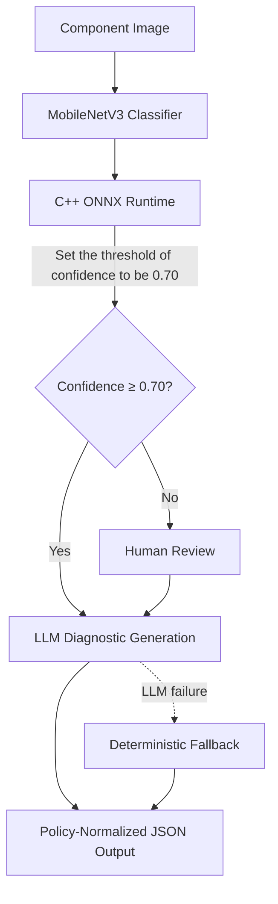

# AI Visual Recognition & LLM Intelligent Diagnostic System for Electronic Components

An intelligent diagnostic system that combines visual recognition with Large Language Models (LLMs) to identify and diagnose electronic components from images.

> **Note:** Large Qwen3 GGUF and adapter artifacts are available in the [GitHub Release — artifacts-v1](https://github.com/ChenKC863/AI-Visual-Recognition-and-LLM-Intelligent-Diagnostic-System-for-Electronic-Components/releases).

---

## Dataset

### Sources
- [1] [Electronic-Components-Classification (GitHub)](https://github.com/pouria-faraj/Electronic-Components-Classification)
- [2] [Electronic Components and Devices (Kaggle)](https://www.kaggle.com/datasets/aryaminus/electronic-components)


### Original Dataset(for my choice)

```text
Electronic components/
└── images/
  ├── Inductor/ # 265 images [1]
  ├── Resistor/ # 470 images [1]
  ├── Solenoid/ # 317 images [2]
  └── Transformer/ # 747 images [1]
```

### Cleaned Dataset
After data cleaning and preprocessing:

```text
Electronic components/
└── images/
  ├── Inductor/ # 260 images
  ├── Resistor/ # 470 images
  ├── Solenoid/ # 310 images
  └── Transformer/ # 740 images
```


---
## 📌 Overview
This project presents an end-to-end intelligent diagnostic system for electronic components, combining computer vision, C++ inference, a fine-tuned Large Language Model (LLM), and human-in-the-loop workflow orchestration. The system classifies component images, evaluates prediction confidence, and produces structured diagnostic guidance for manufacturing operators.

The current prototype supports four component classes:

- Inductor
- Resistor
- Solenoid
- Transformer

A balanced working dataset of **1,040 images** was used, with **260 images per class**:

- Training: 728 images
- Validation: 156 images
- Testing: 156 images

### System Workflow



The project covers the complete AI lifecycle:

1. **Image classification**  
   MobileNetV3-Small and MobileNetV3-Large models are trained using PyTorch transfer learning. Training uses on-the-fly data augmentation, label smoothing, weight decay, learning-rate scheduling, early stopping, and a two-stage fine-tuning strategy.

2. **Portable C++ inference**  
   The trained models are exported to ONNX and executed locally through a C++17 inference engine using ONNX Runtime and OpenCV. The engine performs image preprocessing, classification, latency measurement, confidence visualization, JSON output, and batch CSV export.

3. **Domain-specific LLM fine-tuning**  
   Vision predictions are converted into conversational JSONL datasets and used to fine-tune `Qwen3-4B-Instruct-2507` with QLoRA, Unsloth, PEFT, and TRL `SFTTrainer`. The fine-tuned model is exported to the GGUF `Q4_K_M` format for local deployment through Ollama.

4. **Structured diagnostic output**  
   The LLM produces a validated JSON object containing the predicted component, confidence score, review decision, component function, recommended operator action, and system limitations.

5. **Confidence-based human review**  
   A fixed confidence threshold of **0.70** controls whether a prediction can proceed automatically. Low-confidence cases are routed to an operator, who can approve, reject, or correct the prediction.

6. **LangGraph orchestration**  
   LangGraph manages workflow state, conditional routing, human-review interruptions, local knowledge retrieval, LLM calls, and deterministic fallback behavior.

7. **Reliable fallback and policy enforcement**  
   A local component knowledge base provides verified component functions, operator actions, and limitations. If the LLM is unavailable or returns malformed JSON, the system generates a deterministic diagnostic response instead. Final normalization prevents the LLM from contradicting the confidence policy.


## Project Structure
```text
Four_electronic_components/
├── .git/
├── .gitignore
├── .vscode/
├── .venv/
├── .venv_win/
├── agent/
├── build/
├── configs/
├── knowledge/
├── model/
├── qwen3-4b-instruct-2507-{variant}_model-artifacts/
│     ├── adapter/
│     ├── evaluation/
│     ├── gguf_gguf/
│     ├── prepared_data/
│     ├── artifact_manifest.json
│     ├── confidence_threshold.json
│     ├── environment.json
│     ├── requirements-cloud-lock.txt
│     ├── SHA256SUMS.txt
│     └── training_config.json
├── release_assets/
├── scripts/
├── test/
├── train/
├── val/
├── CMakeLists.txt
├── main.cpp
├── README.md
├── LICENSE
├── requirements-cloud-lock.txt
├── ai-visual-recognition-and-classification-system.ipynb
├── electronics_train_{variant}_model.jsonl
├── electronics_validation_{variant}_model.jsonl
├── electronics_test_{variant}_model.jsonl
└── vision_predictions_{variant}_model.csv
```
where {variant} is large or small.

---


## Getting Started


